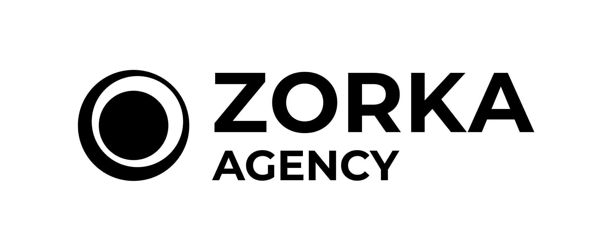

# Zorka.Agency - AI Mediaplan Generator

A modern, mobile-responsive landing page for Zorka.Agency that allows users to interact with an AI chatbot to receive a personalized influencer mediaplan.



## Features

- **Interactive Chat Interface**: Conversational bot that gathers user requirements
- **Lead Capture Form**: Collects corporate email and name for mediaplan delivery
- **Mobile Responsive**: Fully optimized for all device sizes
- **Modern Design**: Clean UI with custom Zorka.Agency branding (#0F0F0F, #FCCD03, #BFBFBF)
- **Form Validation**: React Hook Form + Zod for robust validation
- **Mock Backend**: Ready-to-replace mock API for easy backend integration

## Tech Stack

- **React 18** + **TypeScript** - Modern React with type safety
- **Vite** - Lightning-fast build tool
- **Tailwind CSS** - Utility-first CSS framework
- **React Hook Form** + **Zod** - Form validation
- **React Icons** - Social media and UI icons
- **Context API** - State management for chat

## Project Structure

```
├── public/              # Static assets (logos)
├── src/
│   ├── components/      # React components
│   │   ├── Header.tsx
│   │   ├── Hero.tsx
│   │   ├── MetricsSection.tsx
│   │   ├── ChatInterface.tsx
│   │   ├── ContactForm.tsx
│   │   ├── SuccessModal.tsx
│   │   └── Footer.tsx
│   ├── contexts/        # React Context
│   │   └── ChatContext.tsx
│   ├── utils/           # Utility functions
│   │   ├── validation.ts
│   │   ├── mockChatbot.ts
│   │   └── mockApi.ts
│   ├── types/           # TypeScript types
│   │   └── index.ts
│   ├── App.tsx
│   ├── main.tsx
│   └── index.css
├── tailwind.config.js   # Tailwind configuration
├── vite.config.ts       # Vite configuration
└── package.json
```

## Getting Started

### Prerequisites

- Node.js 18+ and npm

### Installation

1. Clone the repository or navigate to the project directory
2. Install dependencies:

```bash
npm install
```

### Development

Start the development server:

```bash
npm run dev
```

The app will be available at [http://localhost:3000](http://localhost:3000)

### Build for Production

```bash
npm run build
```

The production-ready files will be in the `dist/` directory.

### Preview Production Build

```bash
npm run preview
```

## How It Works

### User Flow

1. **Landing Page**: User sees hero section with value proposition
2. **Metrics Section**: User learns what they'll receive in the mediaplan
3. **Chat Interface**: User interacts with the chatbot, answering questions about:
   - Product/service category
   - Target audience
   - Budget range
   - Geographic preferences
4. **Download Button**: Appears after chat completion
5. **Contact Form**: User enters name and corporate email
6. **Success Modal**: Confirmation that mediaplan was sent to email

### Mock Functionality

The landing page currently uses **mock implementations** for:

- **Chatbot** ([src/utils/mockChatbot.ts](src/utils/mockChatbot.ts)): Simulates conversation flow with predefined questions
- **API** ([src/utils/mockApi.ts](src/utils/mockApi.ts)): Simulates form submission with delay

### Backend Integration

When ready to connect to the real backend, replace mock implementations in:

#### 1. Chatbot Integration

**File:** [src/utils/mockChatbot.ts](src/utils/mockChatbot.ts)

Replace with WebSocket or SSE connection:

```typescript
// Example WebSocket integration
const ws = new WebSocket('wss://api.zorka.agency/chatbot');

ws.onmessage = (event) => {
  const botMessage = JSON.parse(event.data);
  // Handle bot message
};
```

#### 2. Form Submission API

**File:** [src/utils/mockApi.ts](src/utils/mockApi.ts)

Replace with real API endpoint:

```typescript
export const submitForm = async (formData: FormData): Promise<SubmissionResponse> => {
  const response = await fetch('https://api.zorka.agency/submit-form', {
    method: 'POST',
    headers: { 'Content-Type': 'application/json' },
    body: JSON.stringify(formData),
  });
  return response.json();
};
```

#### 3. Environment Variables

Create a `.env` file:

```env
VITE_API_BASE_URL=https://api.zorka.agency
VITE_CHATBOT_WS_URL=wss://api.zorka.agency/chatbot
```

## Design System

### Colors

- **Primary**: `#0F0F0F` (Black) - Primary text, backgrounds
- **Accent**: `#FCCD03` (Yellow) - CTAs, highlights
- **Secondary**: `#BFBFBF` (Gray) - Secondary text, borders

### Typography

- **Headings**: Montserrat (Bold, Semi-Bold)
- **Body**: Roboto (Regular, Medium)

### Fonts

Fonts are loaded via Google Fonts CDN in [index.html](index.html):
- Montserrat (400, 600, 700)
- Roboto (300, 400, 500, 700)

## Features Checklist

- ✅ Responsive header with Zorka.Agency logo
- ✅ Hero section with CTA
- ✅ Metrics section with 5 key metrics
- ✅ Interactive chat interface
- ✅ Mock chatbot conversation flow
- ✅ Download button (enabled after chat completion)
- ✅ Contact form with validation
- ✅ Corporate email validation warning
- ✅ Success modal with auto-dismiss
- ✅ Footer with social media links
- ✅ Mobile-first responsive design
- ✅ Smooth animations and transitions
- ✅ Accessibility features (ARIA labels, keyboard navigation)

## Social Media Links

The footer includes links to:

- [LinkedIn](https://www.linkedin.com/company/zorka-agency)
- [YouTube](https://www.youtube.com/channel/UCFHMWFvmDJXjhri6Y2j3wFg)
- [Instagram](https://www.instagram.com/zorka.agency)
- [Facebook](https://www.facebook.com/zorka.agency)
- [Clutch](https://clutch.co/profile/zorkaagency#reviews)

## Browser Support

- Chrome (latest)
- Firefox (latest)
- Safari (latest)
- Edge (latest)
- Mobile browsers (iOS Safari, Chrome Mobile)

## Performance

- First Contentful Paint: < 1.5s
- Time to Interactive: < 3s
- Lighthouse Performance: > 90
- Lighthouse Accessibility: > 95

## License

© 2024 Zorka.Agency. All rights reserved.

## Support

For questions or issues, contact the Zorka.Agency team.
